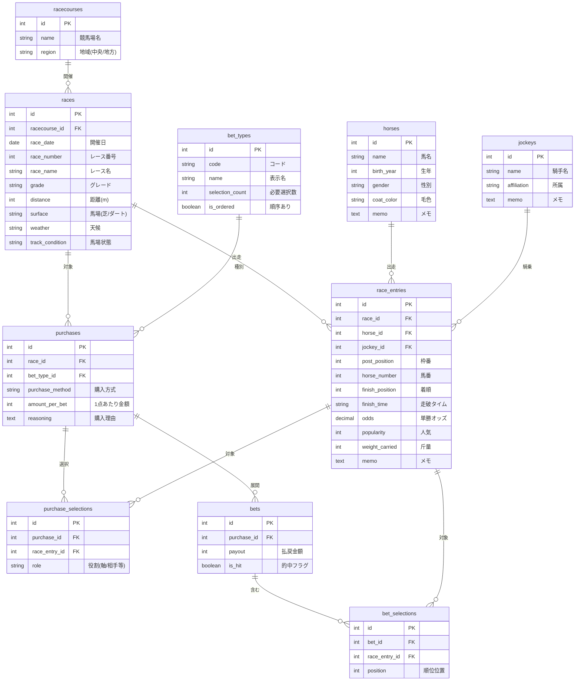

# データベース設計

## 概要
競馬ノートアプリのデータベース設計書

## ER図 (Mermaid)

## テーブル定義

### racecourses (競馬場)
| カラム名 | 型 | 制約 | 説明 |
|---------|-----|------|------|
| id | INTEGER | PK, AUTO_INCREMENT | ID |
| name | VARCHAR(50) | NOT NULL, UNIQUE | 競馬場名 |
| region | VARCHAR(20) | NOT NULL | 地域(中央/地方) |
| created_at | TIMESTAMP | NOT NULL | 作成日時 |
| updated_at | TIMESTAMP | NOT NULL | 更新日時 |

### races (レース)
| カラム名 | 型 | 制約 | 説明 |
|---------|-----|------|------|
| id | INTEGER | PK, AUTO_INCREMENT | ID |
| racecourse_id | INTEGER | FK(racecourses.id), NOT NULL | 競馬場ID |
| race_date | DATE | NOT NULL | 開催日 |
| race_number | INTEGER | NOT NULL | レース番号(1-12) |
| race_name | VARCHAR(100) | | レース名 |
| grade | VARCHAR(20) | | グレード(G1, G2, G3, OP等) |
| distance | INTEGER | NOT NULL | 距離(m) |
| surface | VARCHAR(10) | NOT NULL | 馬場(芝/ダート/障害) |
| weather | VARCHAR(10) | | 天候 |
| track_condition | VARCHAR(10) | | 馬場状態(良/稍重/重/不良) |
| created_at | TIMESTAMP | NOT NULL | 作成日時 |
| updated_at | TIMESTAMP | NOT NULL | 更新日時 |

**インデックス:**
- (racecourse_id, race_date, race_number) UNIQUE

### horses (馬)
| カラム名 | 型 | 制約 | 説明 |
|---------|-----|------|------|
| id | INTEGER | PK, AUTO_INCREMENT | ID |
| name | VARCHAR(50) | NOT NULL | 馬名 |
| birth_year | INTEGER | | 生年 |
| gender | VARCHAR(10) | | 性別(牡/牝/セ) |
| coat_color | VARCHAR(20) | | 毛色 |
| memo | TEXT | | メモ |
| created_at | TIMESTAMP | NOT NULL | 作成日時 |
| updated_at | TIMESTAMP | NOT NULL | 更新日時 |

### jockeys (騎手)
| カラム名 | 型 | 制約 | 説明 |
|---------|-----|------|------|
| id | INTEGER | PK, AUTO_INCREMENT | ID |
| name | VARCHAR(50) | NOT NULL | 騎手名 |
| affiliation | VARCHAR(50) | | 所属(美浦/栗東等) |
| memo | TEXT | | メモ |
| created_at | TIMESTAMP | NOT NULL | 作成日時 |
| updated_at | TIMESTAMP | NOT NULL | 更新日時 |

### race_entries (出走馬)
| カラム名 | 型 | 制約 | 説明 |
|---------|-----|------|------|
| id | INTEGER | PK, AUTO_INCREMENT | ID |
| race_id | INTEGER | FK(races.id), NOT NULL | レースID |
| horse_id | INTEGER | FK(horses.id), NOT NULL | 馬ID |
| jockey_id | INTEGER | FK(jockeys.id) | 騎手ID |
| post_position | INTEGER | | 枠番(1-8) |
| horse_number | INTEGER | NOT NULL | 馬番 |
| finish_position | INTEGER | | 着順 |
| finish_time | VARCHAR(20) | | 走破タイム |
| odds | DECIMAL(10,1) | | 単勝オッズ |
| popularity | INTEGER | | 人気 |
| weight_carried | DECIMAL(4,1) | | 斤量(kg) |
| memo | TEXT | | メモ |
| created_at | TIMESTAMP | NOT NULL | 作成日時 |
| updated_at | TIMESTAMP | NOT NULL | 更新日時 |

**インデックス:**
- (race_id, horse_number) UNIQUE

### bet_types (馬券種別)
| カラム名 | 型 | 制約 | 説明 |
|---------|-----|------|------|
| id | INTEGER | PK, AUTO_INCREMENT | ID |
| code | VARCHAR(20) | NOT NULL, UNIQUE | コード |
| name | VARCHAR(50) | NOT NULL | 表示名 |
| selection_count | INTEGER | NOT NULL | 必要選択数 |
| is_ordered | BOOLEAN | NOT NULL, DEFAULT FALSE | 順序あり(馬単・三連単) |

**初期データ:**
| id | code | name | selection_count | is_ordered |
|----|------|------|-----------------|------------|
| 1 | tansho | 単勝 | 1 | FALSE |
| 2 | fukusho | 複勝 | 1 | FALSE |
| 3 | wakuren | 枠連 | 2 | FALSE |
| 4 | umaren | 馬連 | 2 | FALSE |
| 5 | umatan | 馬単 | 2 | TRUE |
| 6 | wide | ワイド | 2 | FALSE |
| 7 | sanrenpuku | 三連複 | 3 | FALSE |
| 8 | sanrentan | 三連単 | 3 | TRUE |

### purchases (購入)
| カラム名 | 型 | 制約 | 説明 |
|---------|-----|------|------|
| id | INTEGER | PK, AUTO_INCREMENT | ID |
| race_id | INTEGER | FK(races.id), NOT NULL | レースID |
| bet_type_id | INTEGER | FK(bet_types.id), NOT NULL | 馬券種別ID |
| purchase_method | VARCHAR(20) | NOT NULL | 購入方式 |
| amount_per_bet | INTEGER | NOT NULL | 1点あたり金額 |
| reasoning | TEXT | | 購入理由 |
| created_at | TIMESTAMP | NOT NULL | 作成日時 |
| updated_at | TIMESTAMP | NOT NULL | 更新日時 |

**purchase_method の値:**
| 値 | 説明 | 例 |
|----|------|-----|
| normal | 通常（1点買い） | 馬連 1-3 |
| nagashi | 流し | 馬連 1→3,4,5 |
| box | ボックス | 馬連 1,2,3 BOX |
| formation | フォーメーション | 三連単 1,2→3,4→5,6 |

### purchase_selections (購入時の選択)
| カラム名 | 型 | 制約 | 説明 |
|---------|-----|------|------|
| id | INTEGER | PK, AUTO_INCREMENT | ID |
| purchase_id | INTEGER | FK(purchases.id), NOT NULL | 購入ID |
| race_entry_id | INTEGER | FK(race_entries.id), NOT NULL | 出走馬ID |
| role | VARCHAR(20) | NOT NULL | 役割 |
| created_at | TIMESTAMP | NOT NULL | 作成日時 |

**role の値:**
| purchase_method | role | 説明 |
|-----------------|------|------|
| normal | selection | 選択馬 |
| nagashi | pivot | 軸 |
| nagashi | partner | 相手 |
| box | selection | 選択馬 |
| formation | first | 1着候補 |
| formation | second | 2着候補 |
| formation | third | 3着候補 |

**インデックス:**
- (purchase_id, race_entry_id, role) UNIQUE

### bets (展開後の買い目)
| カラム名 | 型 | 制約 | 説明 |
|---------|-----|------|------|
| id | INTEGER | PK, AUTO_INCREMENT | ID |
| purchase_id | INTEGER | FK(purchases.id), NOT NULL | 購入ID |
| payout | INTEGER | DEFAULT 0 | 払戻金額 |
| is_hit | BOOLEAN | DEFAULT FALSE | 的中フラグ |
| created_at | TIMESTAMP | NOT NULL | 作成日時 |
| updated_at | TIMESTAMP | NOT NULL | 更新日時 |

### bet_selections (買い目の内容)
| カラム名 | 型 | 制約 | 説明 |
|---------|-----|------|------|
| id | INTEGER | PK, AUTO_INCREMENT | ID |
| bet_id | INTEGER | FK(bets.id), NOT NULL | 買い目ID |
| race_entry_id | INTEGER | FK(race_entries.id), NOT NULL | 出走馬ID |
| position | INTEGER | | 順位位置(馬単・三連単用: 1=1着, 2=2着, 3=3着、順不同の場合はNULL) |
| created_at | TIMESTAMP | NOT NULL | 作成日時 |

**インデックス:**
- (bet_id, race_entry_id) UNIQUE
- (race_entry_id) - 過去に賭けた馬の検索用

